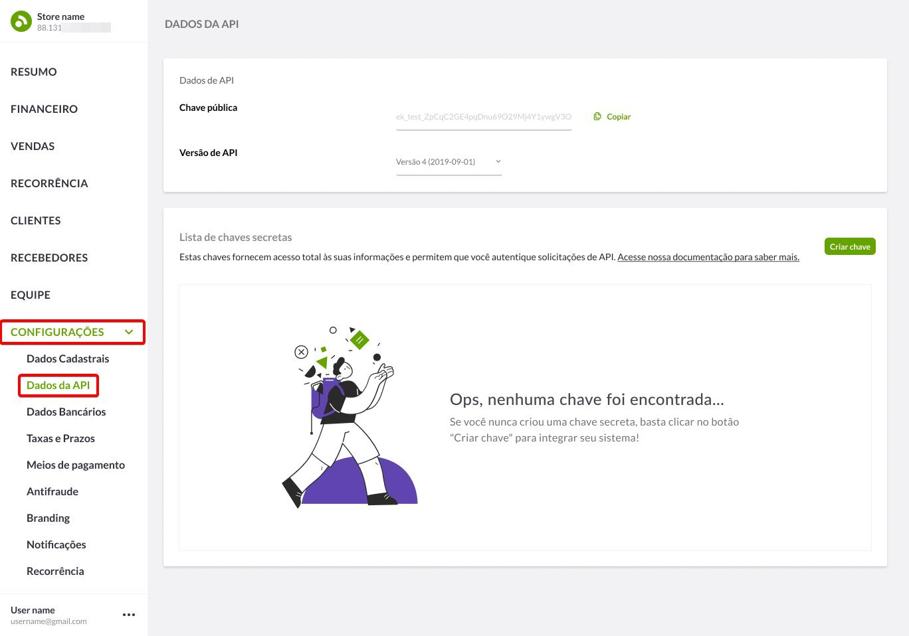

O plugin **WooCommerce Pagar.me** permite que lojistas aceitem pagamentos via API de forma prática e segura. Com suporte a diversas formas de pagamento, como cartão de crédito, débito, Pix e boleto bancário. O plugin também oferece funcionalidade para split de pagamentos integrados ao plugin Dokan. 

### Links

- [Cadastro Pagar.me](https://pagar.me/)
- [Obtendo Credenciais](#obtendo-credenciais)
- [Processo de compra](#processo-de-compra)
 
### Instalação

1. Acesse o painel de administrador do WordPress.
2. Na barra lateral direita, vá para: Plugins > Adicionar novo.
3. Localize o botão "Enviar Plugin" no Topo da tela
4. Selecione os arquivos do nosso plugin dentro do seu computador.
4. Clique em "Instalar agora".
5. Por fim, clique no botão "Ativar" após a instalação.

### Requisitos

- Uma conta Pagar.me
- Credenciais de acesso para API. (As credenciais são obtidas no dashboard Pagar.me)
- Certificado SSL. (É recomendado que sua loja possua um Certificado SSL)
- Plugin "WooCommerce" ativado e instalado.
- Plugin "Brazilian Market on WooCommerce" ativado e instalado.
- Versão mínima do PHP  7.4
- Versão mínima do WordPress  6.2

### Ativando métodos de pagamento

1. Acesse o painel de administrador do WordPress.
2. Na barra lateral direita, vá para: WooCommerce > Configurações.
3. Na nova página aberta localize e selecione a aba "Pagamentos".
4. Marque as opções correspondentes às formas de pagamento "Pagar.me" para selecioná-las como ativas no checkout.
5. Click em "Gerenciar" para abrir a tela principal de configurações da respectiva forma de pagamento.

### Configuraçõs para o cartão de crédito

Na tela de configurções para o método cartão de crédito, insira as demais informações:

- **Ativar/Desativar** Marque para habilitar esta forma de pagamento.
- **Título do Checkout** Este campo controla o título que o usuário vê durante o checkout.
- **Descrição do Checkout** Este campo controla a descrição que o usuário vê durante o checkout.
- **Configurações de Integração** Selecione o ambiente ativo para a API.
- **Chave Pública** Chave Pública da Pagar.me.
- **Chave Secreta** Chave Secreta da Pagar.me.
- **Ambiente de Testes** - Marque para ativar o ambiente de testes da Pagar.me, pode ser utilizado para testar os pagamentos.
- **Chave Pública de Testes** Chave Pública da Pagar.me para Testes.
- **Chave Secreta de Testes** Chave Secreta da Pagar.me para Testes.
- **Configurações de Pagamento** Personalize as opções de pagamento.
- **Menor Parcela** Valor mínimo de cada parcela, não pode ser inferior a 1.
- **Parcelamento** Número máximo de parcelas para pedidos na sua loja.
- **Bandeiras Aceitas** Selecione as bandeiras de cartão que serão aceitas como pagamento.
- **Tipo de Parcelamento** Define quem assume os juros das parcelas no valor total do pedido.
- **Taxa de Juros (%)** Percentual de juros que será cobrado do cliente na parcela em que houver aplicação de juros.
- **Cobrar Juros A Partir De** Indique a partir de qual parcela será cobrado juros.
- **Tipo de Captura** Indique o tipo de captura de pagamento.
- **Texto para Fatura do Cartão** Texto a ser exibido na fatura do cartão de crédito.
- **Coletar Dados do Cartão** Controla como os dados do cartão devem ser manuseados.
- **Log de Depuração** - Marque para ativar o registro de eventos da Pagar.me, como solicitações de API.

!> Ao utilizar um plugin de marketplace compatível, as credenciais da API devem ser inseridas diretamente nas configurações gerais do próprio plugin de marketplace.

### Configuraçõs para o PIX

Na tela de configurções para o método PIX, insira as demais informações:

- **Ativar/Desativar** - Marque para habilitar esta forma de pagamento.
- **Título do Checkout** - Este campo controla o título que o usuário vê durante o checkout.
- **Descrição do Checkout** - Este campo controla a descrição que o usuário vê durante o checkout.
- **Chave Pública** - Chave Pública da Pagar.me.
- **Chave Secreta** - Chave Secreta da Pagar.me.
- **Ambiente de Testes** - Marque para ativar o ambiente de testes da Pagar.me, pode ser utilizado para testar os pagamentos.
- **Chave Pública de Testes** Chave Pública da Pagar.me para Testes.
- **Chave Secreta de Testes** Chave Secreta da Pagar.me para Testes.
- **Minutos para Expiração** - É o número de minutos para o Pix expirar. Por padrão um dia, ou seja, 1440 minutos.
- **Log de Depuração** - Marque para ativar o registro de eventos da Pagar.me, como solicitações de API.

!> Ao utilizar um plugin de marketplace compatível, as credenciais da API devem ser inseridas diretamente nas configurações gerais do próprio plugin de marketplace.

### Configuraçõs para o boleto bancário

Na tela de configurções para o método boleto bancário, insira as demais informações:

- **Ativar/Desativar** - Marque para habilitar esta forma de pagamento.
- **Título do Checkout** - Este campo controla o título que o usuário vê durante o checkout.
- **Descrição do Checkout** - Este campo controla a descrição que o usuário vê durante o checkout.
- **Chave Pública** - Chave Pública da Pagar.me.
- **Chave Secreta** - Chave Secreta da Pagar.me.
- **Ambiente de Testes** - Marque para ativar o ambiente de testes da Pagar.me, pode ser utilizado para testar os pagamentos.
- **Chave Pública de Testes** Chave Pública da Pagar.me para Testes.
- **Chave Secreta de Testes** Chave Secreta da Pagar.me para Testes.
- **Instruções do boleto** - O texto inserido estará impresso no boleto.
- **Dias para Vencimento** - É o número de dias para o vencimento do boleto. Por padrão 2 dias.
- **Log de Depuração** - Marque para ativar o registro de eventos da Pagar.me, como solicitações de API.

!> Ao utilizar um plugin de marketplace compatível, as credenciais da API devem ser inseridas diretamente nas configurações gerais do próprio plugin de marketplace.

------------

# Obtendo credenciais

Obtenha as chaves de acesso para a comunicação entre a API Pagar.me e o plugin **WooCommerce Pagar.me**. As chaves de acesso identificam você como titular de uma conta, são fornecidas de maneira a autorizar o uso de funcionalidades específicas de uma API junto a sua integração.

### Acesso a conta

Isso se aplica caso você ainda não possua as credenciais de API da Pagar.me. Você precisa de uma conta do [Pagar.me](https://www.pagar.me/) para continuar.

### Procedimentos

1. Entre na sua conta da Pagar.me em: [https://www.pagar.me/](https://www.pagar.me/).
2. Localize e clique no menu "Configurações", depois Dados da API.

<figure class="thumbnails">
    
</figure>

3. Clique em **Criar Chave**, insira um nome para identificar a nova chave e digitar a senha da dashboard.

<figure class="thumbnails">
    
</figure>

<figure class="thumbnails">
    
</figure>

4. Use as chaves de API para [configurar](README?id=configuração) as opões do plugin.

------------

# Configuraçõs de Webhooks

Os webhooks são notificações automáticas enviadas sempre que ocorre um evento importante relacionado a um pedido. Eles garantem a sincronização em tempo real do status do pedido entre a Pagar.me e sua loja, mantendo as informações sempre atualizadas.

### Procedimentos

1. Entre na sua conta da Pagar.me em: [https://www.pagar.me/](https://www.pagar.me/).
2. Localize e clique no menu "Configurações", depois Webhooks. Após isso, basta clicar em criar webhook.

<figure class="thumbnails">
    
</figure>

3. Na nova tela insira a URL de Webhook da sua loja e marque os eventos relacionados a **Cartão**, **Cobrança** e **Pedido**. 

<figure class="thumbnails">
    
</figure>

!> A URL do Webhook é formada pelo domínio da sua loja `https://sualoja.com` seguido por `/wc-api/wc_pagarme_webhook/`. Você pode encontrar essa URL ao final das configurações dos meios de pagamento.

!> Ao utilizar um plugin de marketplace compatível, marque também os eventos relacionados a **Conta bancária**, **Recebedor** e **Transferência**.

4. Salve as configurações e confirme se o webhook foi criado com sucesso.

------------

